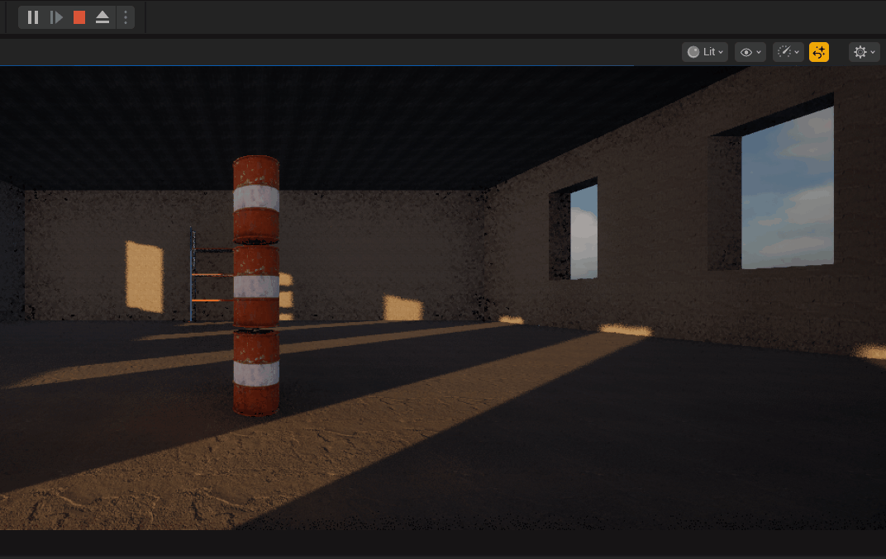

# Section 2 - Warehouse Wreckage

> On this section I will be working on mainly physics: how it interacts with the environment, how to implement those interactions as events using Blueprints, as well as building/loading a basic level to shoot projectiles !

  
  

---

## What I Learned 
- First steps on the engine, tools and getting used to actors/classes
- Interaction with Physics through Blueprints
- Spawning actors using events
- Loading/reloading levels
